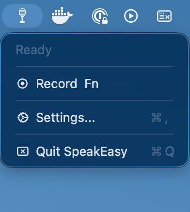
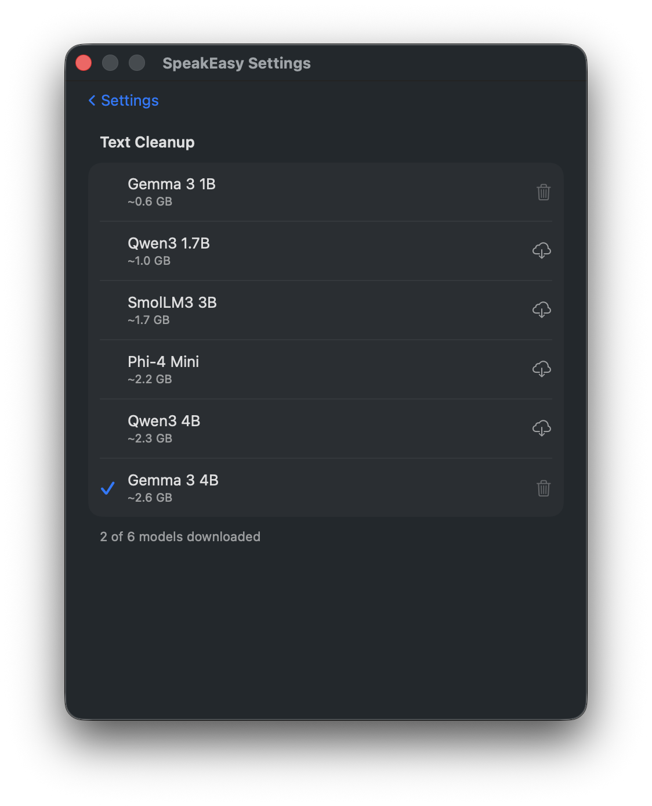

# SpeakEasy

macOS menu bar dictation app. Press a hotkey from anywhere, speak, press it again to stop and your words are transcribed and pasted wherever your cursor is. No clicking, no switching windows.

Everything runs on-device. No telemetry. No cloud. No account. Your voice never leaves your Mac.

> **Requires macOS 26 (Tahoe) or later**

---

## ⬇️ Download

Grab the latest release from the [Releases page](../../releases/latest).

Mount the DMG, drag SpeakEasy to Applications, and launch it.

---

## 🎙️ How it works

1. Press **Control + Shift + Space** (customizable) from any app
2. Speak — a small floating indicator shows you're recording
3. Press the shortcut again to stop
4. Your transcribed text is pasted into wherever your cursor was

SpeakEasy uses Apple's on-device speech recognition (macOS 26+) or a locally downloaded Whisper model. An optional AI cleanup pass fixes punctuation and removes filler words before pasting. Both run entirely on your Mac.

---

## 🔐 Permissions

SpeakEasy needs four permissions to function. An onboarding screen walks you through each one on first launch:

| Permission | Why |
|---|---|
| Microphone | Captures your voice |
| Speech Recognition | Converts speech to text on-device |
| Input Monitoring | Detects the hotkey while SpeakEasy is in the background |
| Accessibility | Pastes text into any app |

All four are required. The app won't proceed until they're all granted.

If you previously granted permissions but the app doesn't detect them (can happen after reinstalling), go to **System Settings > Privacy & Security** and remove/re-add SpeakEasy for the affected permission.

---

## ⚙️ Settings

Open **Settings** from the menu bar icon or press **⌘,**:

- **Hotkey** — change the shortcut, or switch to push-to-talk mode
- **Speech Recognition** — Native (Apple) or Whisper (local model); language/locale picker
- **Text Cleanup** — toggle on/off; choose Native or a local model
- **Model Manager** — download and manage local Whisper and LLM models
- **Clipboard Mode** — copy to clipboard instead of pasting at cursor
- **Live Transcription** — show real-time transcript in the recording HUD
- **Sound Feedback** — optional start/stop sounds
- **Transcription History** — save and access recent transcriptions from the menu bar

---

## 🏪 Why not the App Store?

Global hotkey detection requires a macOS capability that's incompatible with the App Store sandbox. Direct distribution with notarization is the only option and the app is still cryptographically signed and verified by Apple.

---

## 🔒 Privacy

SpeakEasy collects no data. Not some data. Not anonymized data. No data.

- **Audio never leaves your Mac** — transcription runs entirely on-device via Apple Intelligence or a local Whisper model
- **No network access** — the app makes zero outbound connections
- **No account required** — nothing to sign up for, nothing to log in to

This is by design. SpeakEasy exists to be the voice tool you can trust completely.

---

## 🐛 Issues & Feedback

[Open an issue](../../issues/new/choose) to report a bug or request a feature.

---

## 📸 Screenshots

<table>
  <tr>
    <td align="center"> Menu bar</td>
    <td align="center"> Settings</td>
  </tr>
  <tr>
    <td align="center"> Whisper model downloads</td>
    <td align="center"> Text cleanup model downloads</td>
  </tr>
</table>
