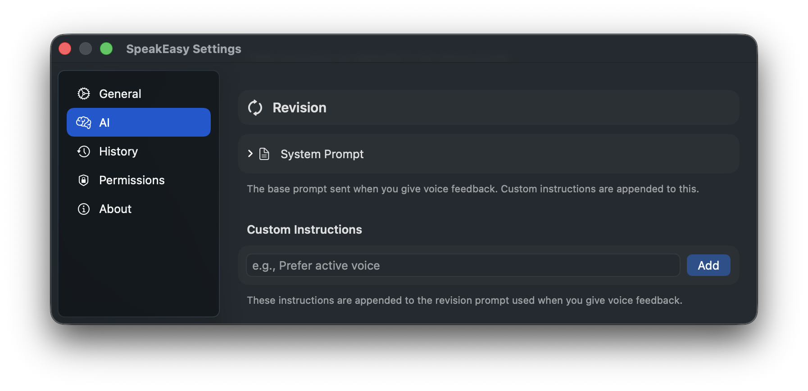

# SpeakEasy

macOS menu bar dictation app. Press a hotkey from anywhere, speak, press it again to stop and your words are transcribed and pasted wherever your cursor is. No clicking, no switching windows.

Everything runs on-device. No telemetry. No cloud. No account. Your voice never leaves your Mac.

> **Requires macOS 26 (Tahoe) or later**

---

## ⬇️ Download

Grab the latest release from the [Releases page](../../releases/latest).

Mount the DMG, drag SpeakEasy to Applications, and launch it.

---

## 🎙️ How it works

1. Press **Control + Shift + Space** (customizable) from any app
2. Speak — a small floating indicator shows you're recording
3. Press the shortcut again to stop
4. Your transcribed text is pasted into wherever your cursor was

SpeakEasy uses Apple Intelligence for on-device speech recognition and text cleanup (macOS 26+). An optional AI cleanup pass fixes punctuation, removes filler words, and converts spoken symbols ("slash settings" → `/settings`, "dot com" → `.com`) before pasting. With "Review before pasting" enabled, you can inspect cleaned text and give voice feedback to revise it before accepting. Everything runs entirely on your Mac.

---

## 🔐 Permissions

SpeakEasy needs four permissions to function. An onboarding screen walks you through each one on first launch:

| Permission | Why |
|---|---|
| Microphone | Captures your voice |
| Speech Recognition | Converts speech to text on-device |
| Input Monitoring | Detects the hotkey while SpeakEasy is in the background |
| Accessibility | Pastes text into any app |

All four are required. The app won't proceed until they're all granted.

If you previously granted permissions but the app doesn't detect them (can happen after reinstalling), go to **System Settings > Privacy & Security** and remove/re-add SpeakEasy for the affected permission.

---

## ⚙️ Settings

Open **Settings** from the menu bar icon or press **⌘,**. Settings are organized into tabs:

- **General** — hotkey, push-to-talk mode, language picker, clipboard mode, text cleanup toggle, review before pasting, live transcription, show cleaned text in HUD, sound feedback, transcription history toggle
- **AI** — cleanup presets (Standard, Formal, Casual, Technical, Minimal, Custom) with toggleable rules; custom instructions for cleanup and revision; read-only system prompts
- **History** — browse past transcriptions with timestamps and raw vs. cleaned text; configure how many entries to keep (10, 25, 50, or 100)
- **Permissions** — check and manage required macOS permissions at a glance
- **About** — version info and links

---

## 🏪 Why not the App Store?

Global hotkey detection requires a macOS capability that's incompatible with the App Store sandbox. Direct distribution with notarization is the only option and the app is still cryptographically signed and verified by Apple.

---

## 🔒 Privacy

SpeakEasy collects no data. Not some data. Not anonymized data. No data.

- **Audio never leaves your Mac** — transcription and text cleanup run entirely on-device via Apple Intelligence
- **No network access required** — everything runs locally, no data is transmitted
- **No account required** — nothing to sign up for, nothing to log in to

This is by design. SpeakEasy exists to be the voice tool you can trust completely.

---

## 🐛 Issues & Feedback

[Open an issue](../../issues/new/choose) to report a bug or request a feature.

---

## 📸 Screenshots

   
  Dictate anywhere — text appears at your cursor

<table>
  <tr>
    <td align="center"> Menu bar</td>
    <td align="center"> Recent transcriptions</td>
  </tr>
  <tr>
    <td align="center"> Settings — General</td>
    <td align="center"> Settings — AI (Text Cleanup)</td>
  </tr>
  <tr>
    <td align="center"> Settings — AI (Revision)</td>
    <td align="center"> Settings — Permissions</td>
  </tr>
  <tr>
    <td align="center"> Settings — About</td>
    <td></td>
  </tr>
</table>
